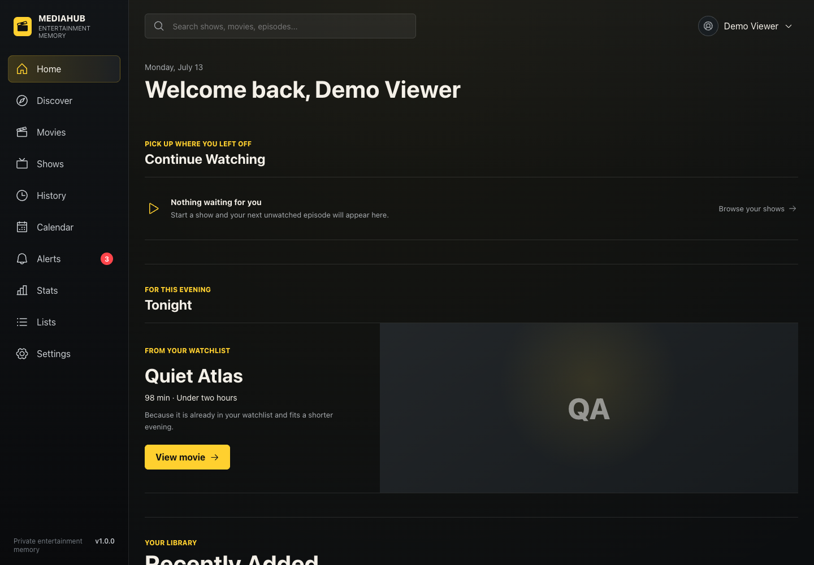
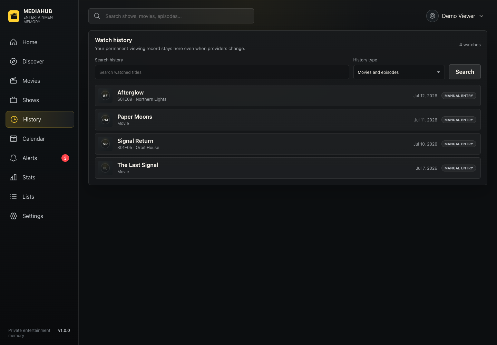
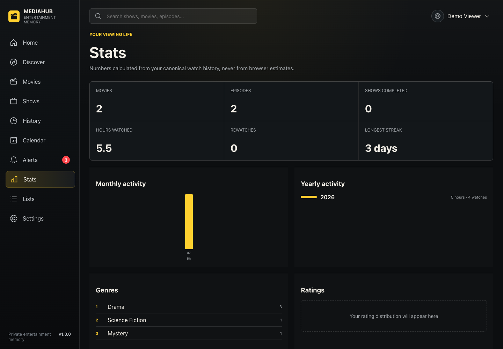
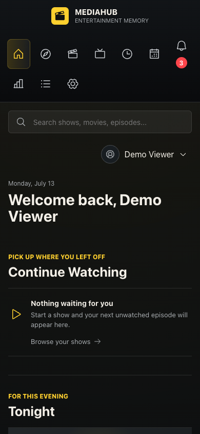

# MediaHub

**Status:** Active development · source-visible · pre-public-launch

MediaHub is a movie and television tracking platform built around user-owned history. It combines a React product interface with a Laravel API for discovery, diary entries, collections, recommendations, statistics, and privacy-aware social features.

## Why MediaHub exists

Media tracking should not depend on one provider or trap a person's viewing history inside one service. MediaHub keeps canonical titles, watch history, ratings, notes, lists, and profile choices separate from optional metadata and playback providers.

## Core capabilities

- Personal movie and television library
- Append-only watch diary and history
- Discovery, search, calendars, alerts, and recommendations
- Ratings, private notes, collections, and statistics
- Data export and compatibility imports
- Opt-in profiles and friendship controls with private-by-default settings
- Administrative review tools and background metadata jobs

## Product boundaries

MediaHub is under active development. It is not presented as a public service, does not claim users, customers, or revenue, and does not provide a shared stream catalog. Third-party imports are compatibility features rather than the product identity.

## Architecture overview

The React/Vite frontend talks to a Laravel API using same-origin session authentication. Laravel owns authorization, user-scoped canonical media, history, lists, profiles, imports, exports, background jobs, and provider boundaries. See [the architecture overview](docs/architecture.md).

## Technology stack

- React 19, Vite, Vitest, Testing Library
- Laravel 13, PHP 8.3+, Filament, PHPUnit
- SQLite for local development; Laravel-supported relational storage by environment
- Optional metadata-provider integrations behind server-side boundaries

## Privacy and user-data ownership

Viewing history, ratings, notes, lists, exports, provider configuration, and profile visibility remain scoped to the owning account. Public profile responses use an explicit allowlist. Secrets, raw provider locators, private exports, and operational infrastructure do not belong in this repository.

## Screenshots

Screenshots use synthetic demo data and are reviewed under the [screenshot policy](docs/040-mediahub-screenshot-policy.md).

| Dashboard | Diary |
| --- | --- |
|  |  |

| Statistics | Mobile |
| --- | --- |
|  |  |

## Local setup

Prerequisites: Node.js 22+, npm 10+, PHP 8.3+, Composer 2, and the PHP extensions required by `backend/composer.json`.

```bash
npm ci
cp backend/.env.example backend/.env
composer install --working-dir=backend
php backend/artisan key:generate
php backend/artisan migrate --graceful
```

Run the frontend and backend in separate terminals:

```bash
npm run dev
php backend/artisan serve
```

Keep real imports under ignored private paths. The compatibility importer requires explicit source arguments; see [import and export documentation](docs/mediahub/IMPORT_RELATIONSHIP_REPAIR.md).

## Testing

```bash
npm test
npm run build
python3 -m unittest discover -s tests
composer validate --working-dir=backend --strict
php backend/artisan test
backend/vendor/bin/pint --test
```

## Documentation map

- [Product scope](docs/mediahub/WEB_PRODUCT_SCOPE.md)
- [Canonical media contract](docs/mediahub/CANONICAL_MEDIA_CONTRACT.md)
- [Architecture](docs/architecture.md)
- [Profiles and privacy](docs/mediahub/PROFILES_AND_FRIENDS_SPEC.md)
- [Import relationship repair](docs/mediahub/IMPORT_RELATIONSHIP_REPAIR.md)
- [Testing and contribution workflow](CONTRIBUTING.md)
- [Public-evidence audit](docs/038-github-professionalization-mediahub-audit.md)
- [Rename plan](docs/039-mediahub-rename-plan.md)
- [Screenshot policy](docs/040-mediahub-screenshot-policy.md)
- [Asset strategy](docs/041-mediahub-asset-strategy.md)
- [Dependency review](docs/042-mediahub-dependency-review.md)
- [Main-promotion plan](docs/043-mediahub-main-promotion-plan.md)
- [Professionalization review](docs/044-github-professionalization-mediahub-review.md)

## Security

Please follow [SECURITY.md](SECURITY.md). Do not disclose vulnerabilities, credentials, private user data, or operational infrastructure in public issues.

## Roadmap

Near-term priorities are product coherence, trustworthy import status, stronger accessibility coverage, deterministic demo fixtures, and a reviewed repository rename to `gunnero/mediahub`.

## License status

No public license has been granted. The current recommendation is **proprietary source-visible pending approved legal wording**. See the professionalization review before changing package metadata or adding a license.

## Disclaimer

MediaHub is an independent project and is not affiliated with TV Time or its owners. References to TV Time describe supported import compatibility only. Movie and television metadata or artwork remains subject to the terms of its respective provider.
