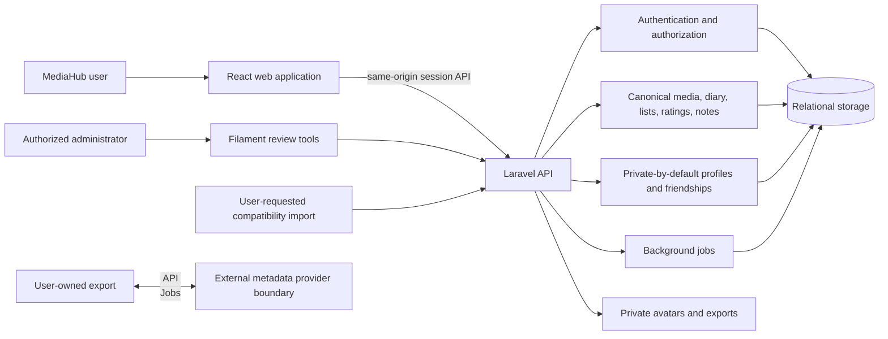

# MediaHub architecture

MediaHub separates a browser product surface from an authenticated Laravel domain backend. Personal media records remain user-scoped; imports and external metadata enter through explicit boundaries rather than becoming shared global identity.

## Frontend and backend boundaries

React owns navigation, interaction state, responsive presentation, and accessible client behavior. Laravel owns identity, authorization, validation, persistence, auditing, and server-side integration calls. Browser bundles must never contain service credentials or raw private provider configuration.

## Authentication

The web application uses same-origin session authentication with CSRF protection. Private API routes require an authenticated account. Administrative tools are a separate authorized surface and must not be inferred from normal user access.

## Privacy and data ownership

Canonical movies, shows, episodes, watch diary entries, ratings, notes, lists, preferences, and exports are scoped by owner. Profiles default to private, friendships require explicit acceptance, and public profile responses use a strict allowlist. Account data is never treated as a shared catalog.

## Import pipeline

Compatibility imports are user-requested, validated, and written into the owning user's canonical library. Import sources remain private and ignored. The pipeline records provenance without making a third-party service MediaHub's identity.

## Diary and history

Watch history is append-only where repeated watches are meaningful. Canonical history is separate from temporary provider state so disabling a provider does not erase personal records.

## Discovery and recommendations

Discovery requests public metadata through a server-side provider boundary. Results remain transient until a user explicitly adds them. Recommendations should derive from authorized, user-scoped signals and expose no private data across accounts.

## Social boundaries

Social behavior is opt-in and privacy-aware. MediaHub does not expose private notes, raw history, provider details, credentials, account roles, internal identifiers, or private exports through public profiles.

## Background jobs and notifications

Jobs perform metadata enrichment, catalog synchronization, alerts, and maintenance. They use the same authorization and data-minimization rules as synchronous requests. Notifications are derived from user-scoped state and preferences.

## Storage

Relational storage holds domain records. Private filesystem storage holds avatars, imports, and exports that must not be served as public static files. Generated caches and user files are excluded from Git.

## Deployment principles

Deployment details live outside this public repository. A safe release verifies the reviewed commit and environment, captures a backup, installs locked dependencies, applies migrations safely, builds assets, rebuilds caches, runs smoke tests, and retains a tested rollback path. No hostnames, credentials, ports, or private topology are required to explain those principles.
